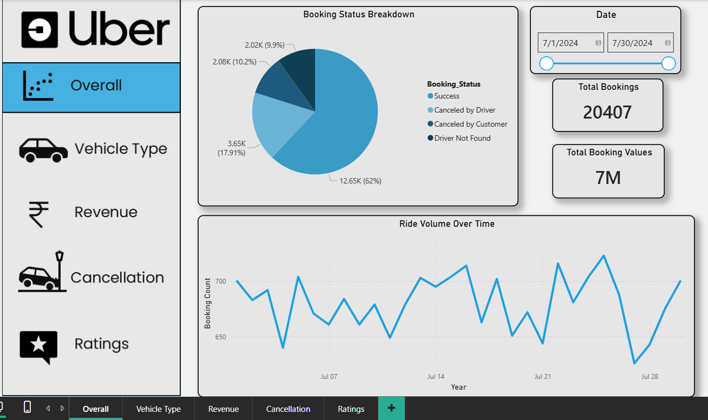
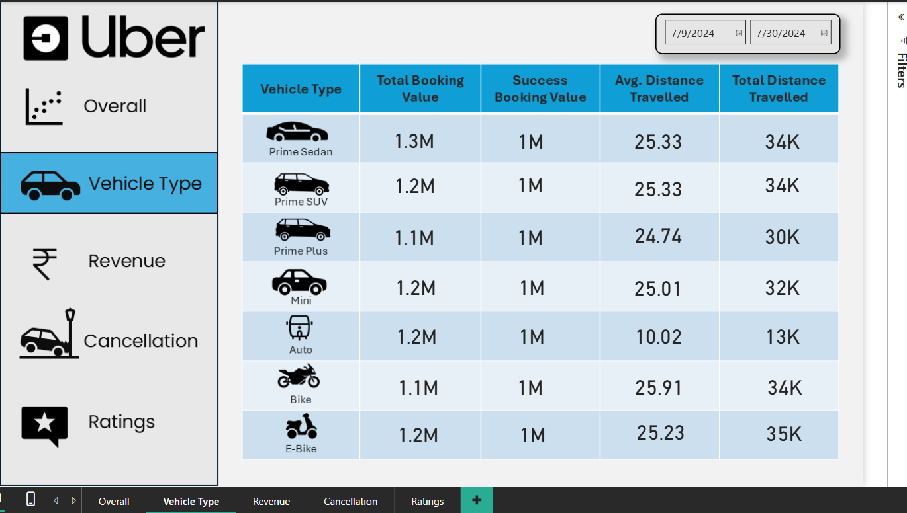
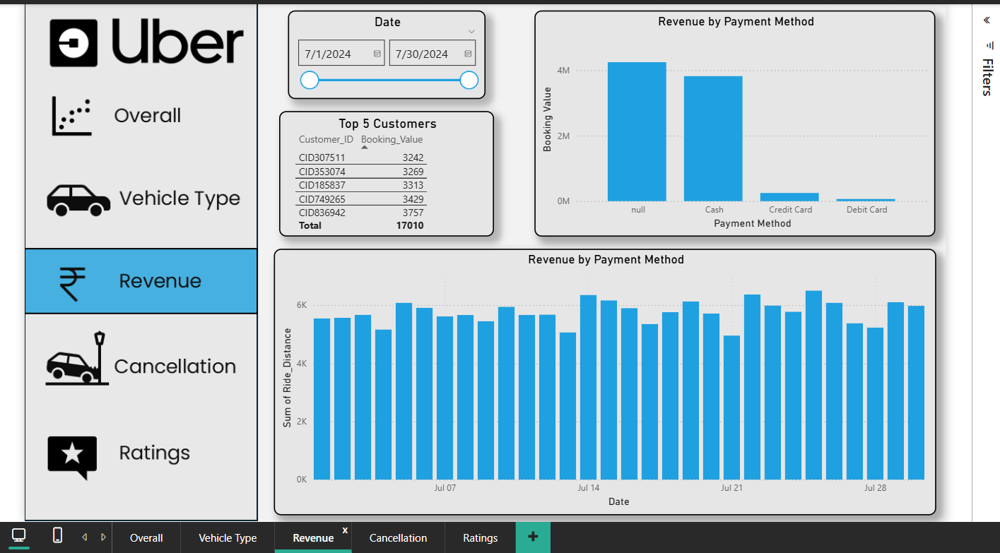
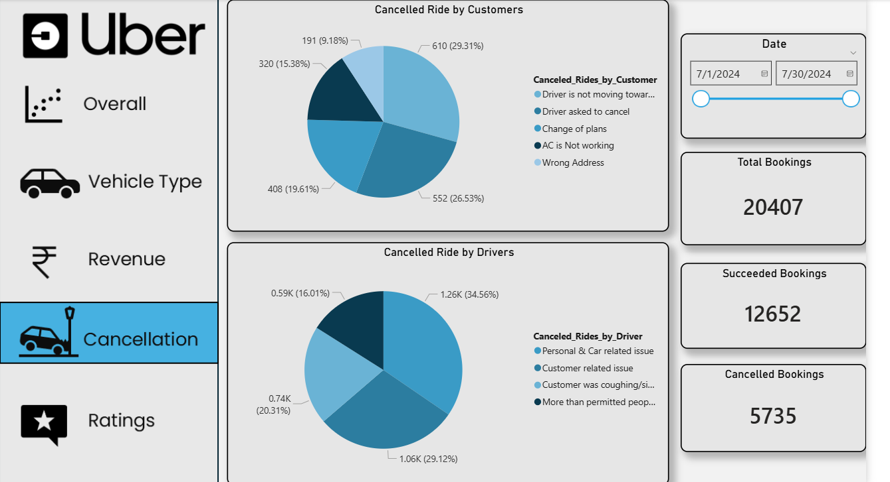
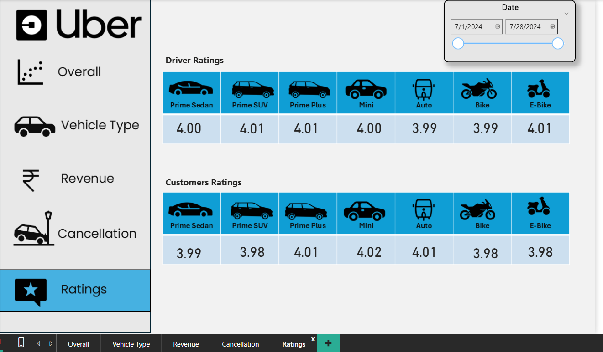

# 🚖 Uber Trip Analysis Dashboard

An end-to-end data analytics project analyzing Uber ride booking data for 2024 using SQL and Power BI.

---

## 📊 Project Overview

This project analyzes 20,000+ Uber ride booking records to uncover:

- Booking trends over time
- Revenue patterns
- Cancellation behavior
- Vehicle performance analysis
- Customer and driver ratings insights

---

## 🛠 Tools & Technologies Used

- SQL (MySQL)
- Power BI
- CSV Dataset
- Data Cleaning & Transformation

---

## 📁 Dataset Details

- Total Records: 20,000+
- Year Covered: 2024
- Domain: Transportation / Ride Analytics

---

## 🔍 SQL Analysis Performed

Key SQL queries include:

- Successful bookings retrieval
- Average ride distance by vehicle type
- Customer cancellation analysis
- Driver cancellation issue analysis
- Top 5 customers by ride count
- UPI payment booking extraction
- Total successful booking revenue

---

## 📈 Dashboard Pages

### 1. Overall Dashboard
- Ride Volume Over Time
- Booking Status Breakdown
- Total Bookings KPI
- Total Revenue KPI

### 2. Vehicle Type Analysis
- Booking value by vehicle type
- Distance travelled comparison

### 3. Revenue Dashboard
- Revenue by payment method
- Top 5 customers by booking value

### 4. Cancellation Dashboard
- Customer cancellation reasons
- Driver cancellation reasons

### 5. Ratings Dashboard
- Driver ratings comparison
- Customer ratings comparison

---

## 💡 Key Business Insights

- Success bookings account for 62% of total rides.
- Cash payments generate highest revenue.
- Prime Sedan contributes highest booking value.
- Customer cancellations mainly happen due to driver delays.
- Average ratings remain around 4.0 across all vehicle types.

---

## 📷 Dashboard Preview

### Overview Dashboard

### Vehicle Type Dashboard

### Revenue Dashboard

### Cancellation Dashboard

### Ratings Dashboard

---

## 🚀 How to Use

1. Download the Uber_Dashboard.pbix file.
2. Open it in Power BI Desktop.
3. Load the dataset file: uber_trip_data_2024.csv if required.
4. Run SQL queries from uber_analysis_queries.sql for database analysis.
5. Explore dashboard pages:
   - Overview
   - Vehicle Type
   - Revenue
   - Cancellation
   - Ratings
     
---

## 👩‍💻 Author

**Aditi Mozarkar**  
Aspiring Data Analyst | SQL | Power BI | Data Visualization  

GitHub: [AditiMozarkar](https://github.com/AditiMozarkar)  
LinkedIn: [Aditi Mozarkar](https://www.linkedin.com/in/aditi-mozarkar)
